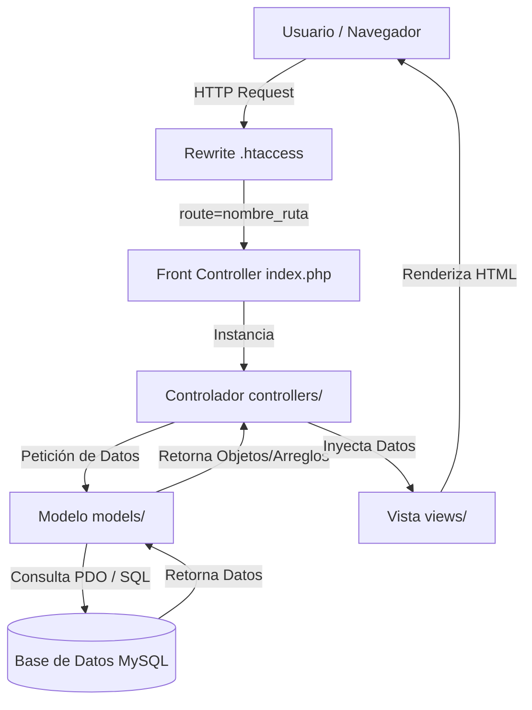

El proyecto se desarrolla bajo el patrón de diseño **Modelo-Vista-Controlador (MVC)**, lo cual permite una clara separación de la interfaz de usuario, la lógica de negocio y las llamadas a base de datos.

## Estructura de Directorios

El código fuente del proyecto está organizado de la siguiente manera:

* **📁 config/**: Contiene las configuraciones globales del sistema.
  * [Autoload.php](file:///c:/xampp/htdocs/TIENDA_MVC/config/Autoload.php): Sistema de autocarga de clases.
  * [Database.php](file:///c:/xampp/htdocs/TIENDA_MVC/config/Database.php): Clase de conexión mediante PDO.
* **📁 controllers/**: Contiene los controladores que reciben los parámetros del usuario, llaman a los modelos y renderizan las vistas.
  * [AuthController.php](file:///c:/xampp/htdocs/TIENDA_MVC/controllers/AuthController.php): Autenticación.
  * [ProductoController.php](file:///c:/xampp/htdocs/TIENDA_MVC/controllers/ProductoController.php): Operaciones administrativas de productos.
  * [PublicController.php](file:///c:/xampp/htdocs/TIENDA_MVC/controllers/PublicController.php): Catálogo público.
* **📁 models/**: Contiene las clases que realizan las consultas directas de base de datos.
  * [UsuarioModel.php](file:///c:/xampp/htdocs/TIENDA_MVC/models/UsuarioModel.php): Consultas de usuario.
  * [ProductoModel.php](file:///c:/xampp/htdocs/TIENDA_MVC/models/ProductoModel.php): ABM y paginación de productos.
* **📁 views/**: Contiene las plantillas de presentación (HTML + PHP incrustado).
  * `layouts/`: Cabecera y pie de página responsivos comunes.
  * `auth/`: Vista del formulario de login.
  * `productos/`: Vistas CRUD (index, create, edit).
  * `public/`: Vista de catálogo público.
* **📄 index.php**: Controlador frontal único de la aplicación.
* **📄 .htaccess**: Configuración del motor de reescritura de Apache.

---

## Flujo de Trabajo (MVC)

El flujo de una petición típica en el sistema funciona de la siguiente manera:



---

## Sistema de Autocarga (Autoload)

El proyecto utiliza **Namespaces** de PHP para organizar las clases en módulos. La autocarga se realiza en [Autoload.php](file:///c:/xampp/htdocs/TIENDA_MVC/config/Autoload.php):

```php config/Autoload.php
spl_autoload_register(function ($class) {
    $baseDir = __DIR__ .'/../';
    $class = str_replace('\\','/', $class);
    $parts = explode('/', $class);
    if (!empty($parts)) {
        $parts[0] = strtolower($parts[0]); // Convierte el Namespace raíz (Config, Models, Controllers) a minúsculas para coincidir con la carpeta
    }
    $file = $baseDir . implode('/', $parts) . '.php';
    if(file_exists($file)) {
        require_once $file;
    }
});
```

Esto permite instanciar cualquier clase del proyecto con la directiva `use` sin necesidad de incluir archivos manualmente con `require` o `include` repetitivos.
